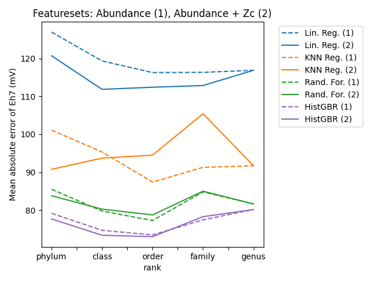

# orpML

This repository has files for the study:
*Machine learning prediction of redox potential from microbial abundances*.

The name `orpML` comes from the acronyms for oxidation-reduction potential (ORP) and machine learning.
- The goal is to develop methods for predicting ORP from DNA sequence data for microbial communities.
- Reliable predictions of ORP would help understand community-level responses to environmental shifts.
- This information can inform the management of microbial communities for biotechnological purposes.

The features (X values) in the dataset consist of microbial abundances augmented with genome-derived features.
- Relative abundances of microbial groups at multiple taxonomic ranks were inferred from 16S rRNA gene sequences.
- Carbon oxidation state (Zc) of proteins at the same taxonomic ranks was computed from reference genomes, weighted by microbial abundances.

The targets (y values) in the dataset are ORP values (aka Eh) corrected to pH 7, which are denoted as Eh7.
The values are given in units of millivolts (mV) and were derived from Eh-pH measurements reported in various studies.
The data sources are described by [Dick and Meng (2023)](https://doi.org/10.1128/msystems.00014-23).

The usage is briefly described below.

## Interactive use

This imports the package and sets up the data preprocessor to use abundances of phyla as the features.
By default, only the 100 most abundant taxa at a given rank (in this case, phylum) are used.
Then we fit a ranfor (random forests) model to the data, make predictions, and calculate the mean absolute error using the test set.

```python
from orpML import *
from sklearn.metrics import mean_absolute_error
preprocessor.set_params(feat__abundance__use__rank = "phylum", feat__Zc__use__rank = None)
ranfor.fit(X_train, y_train)
y_pred = ranfor.predict(X_test)
print(mean_absolute_error(y_pred, y_test))
```

The result shows that the predictions of Eh7 are accurate to within ca. 80 mV on average.
Can we do better?

## Running the scripted workflows

Workflows have been implemented to evaluate the performance of different preprocessing steps and model hyperparameters.

### Run models with scikit-learn

The first four commands perform different grid searches and save the results in the `results/` directory.
The last command uses the optimized hyperparameters to make predictions on the test set.

```python
search_1_no_Zc()
search_2_with_Zc()
search_3_abundance_vs_Zc()
search_4_hyperparameters()
search_5_test_predictions()
```

### Evaluating and plotting results

This plots the mean absolute error (MAE) for different combinations of regression models (linear regression, K nearest neighbors, random forests, HistGBR) and features (only abundance, or both abundance and Zc).
The result shows that HistGBR (histogram-based gradient boosting regressor) outperforms random forests, reducing the error in predicted Eh7 by upwards of 5 mV.
The error is also lower when using abundances of taxonomic classes or orders instead of phylum-level abundances.

```python
plot_1_regressor()
```



### Get data (optional)

NOTE: The repo contains the combined data file (`Bacteria.csv.xz`) that is used for downstream processing.
The following steps only need to be run if you want to recreate this file.

Running R in the `data/` directory:

```R
source("get_data.R")
get_data(feature = "abundance")
get_data(feature = "Zc")
```

This produces two files: `Bacteria_phylum_abundance.csv` and `Bacteria_phylum_Zc.csv`.
The first five columns of each file are metadata, including the target variable (Eh7).
The remaining columns are either relative abundance values or Zc; the latter is missing if abundance = 0.

```R
combine_files()
```

This combines the previously created .csv files into one file.

## Modular design

For better reusability and maintenance, a modular design is adopted that follows a modified extract-transform-load (ETL) workflow.
The modified workflow is extract-transform-model-search-plot (ETMSP).
The transform step encompasses data preprocessing.
The load step, which is renamed as "search", runs hyperparameter searches and saves (loads) the results to files for plotting and further evaluation.

### `extract.py`
This module extracts the data from the `data/` directory and creates the following object for downstream processing:

- `X_train, X_test`: Train and test splits for features (abundance and Zc at all taxonomic ranks)
- `y_train, y_test`: Train and test splits for target (Eh7)
- `metadata_train, metadata_test`: Sample metadata, such as name, location, etc.

### `transform.py`
This module contains the functions and classes used for preprocessing the data:

- `ListTopTaxa()`: Function to list the n most abundant taxa
- `KeepTopTaxa()`: Transformer class to keep columns with the n most abundant taxa
- `PrintOnce()`: Function to print a message only once during `GridSearchCV()`
- `SelectFeatureCols()`: function to select feature columns for a specified taxonomic rank
- `SelectFeatures()`: Transformer class to select features: abundance and/or Zc each for a given rank
- `DropNACols()`: Transformer class to drop columns with frequency of NA values above a certain threshold

### `model.py`
This module implements the traditional regression models made with scikit-learn.

### `deep_model.py`
This module implements the deep learning models made with PyTorch.

### `search.py`
This module defines the grid searches over selected parameters and loads the results into the `results/` directory.

### `plot.py`
The functions in this file require the saved results from `search.py`.
These results are saved in the repository, so the plots can be made without having to rerun the previous functions.
